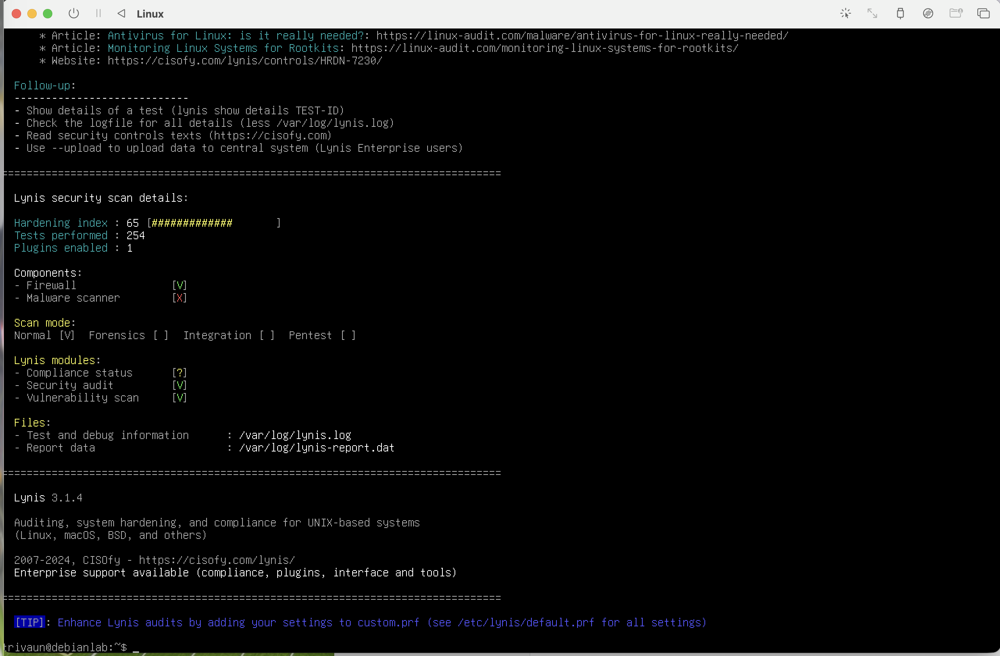

# Automated Security Hardening & Compliance Auditing (Debian 13)

## Project
This project demonstrates the automated implementation of a security baseline on Linux OS (Debian 13) VM via UTM. Utilizing Ansible I deployed a configuration-as-code solution to enforce CIS (Center for Internet Security) benchmarks,reducing the system's attack surface.

## ️ Tech
 OS:Debian 13 (Testing)
 Automation: Ansible
 Auditing:Lynis Security Auditor
 Standards: CIS Debian 11 Benchmark (Adapted for Debian 13)

##  Security Controls Implemented
| Control Category | Technical Action | Result |
 
 Identity & Auth | Disabled Root SSH login; Enforced Password Complexity |
 System Protection | Blacklisted `usb-storage` kernel modules |
 System Monitoring | Configured `systemd-journald` for audit trails |
 Legal Compliance | Deployed mandatory System Use Banners (MOTD) |

## Results
The system's security posture was validated by using Lynis. 
 Pre-Hardening Score:35
 Post-Hardening Score:65
 Status: Compliant with Core CIS Level 1 Requirements.

## Lessons Learned
 Version Adaptation: Successfully adapted a Debian 11 CIS role for Debian 13 by implementing variable overrides.
 Conflict Resolution: Identified and resolved a kernel module conflict where `usb-storage` was held open by the UTM hypervisor.
